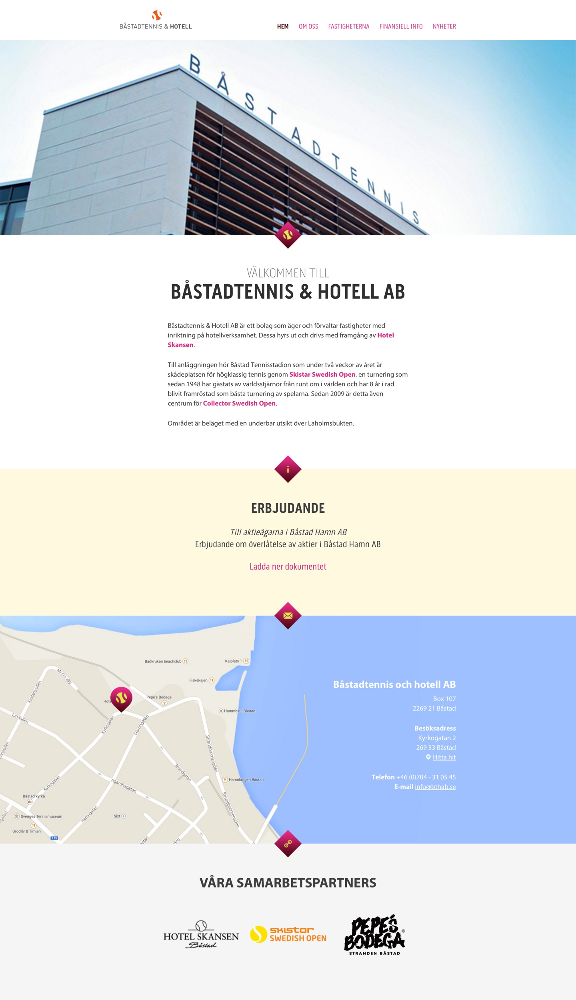


## Tydliga ramar
För mig är BTHAB ett roligt case att visa upp. En liten hemsida, med förbestämt innehåll och en ganska begränsad budget. Jag behövde därför tänka på hur det bildmaterial som redan fanns gick att använda på ett nytt sätt, hur de funktioner som behövde finnas kunde effektiviseras samt ta rätt fria tyglar i hur de presenterades.

{.img-border}

## Gör smarta val
På Understandit har jag från dag ett fått lära mig vikten av att skapa användbar administration. Trots storleken på BTHAB är ingenting hårdkodat, det som ska kunna ändras går att ändra, vissa funktioner har förenklats mot hur jag vanligtvis bygger dem men det krävs inga plötsliga manuella handpåläggningar. En liten men bra sida.