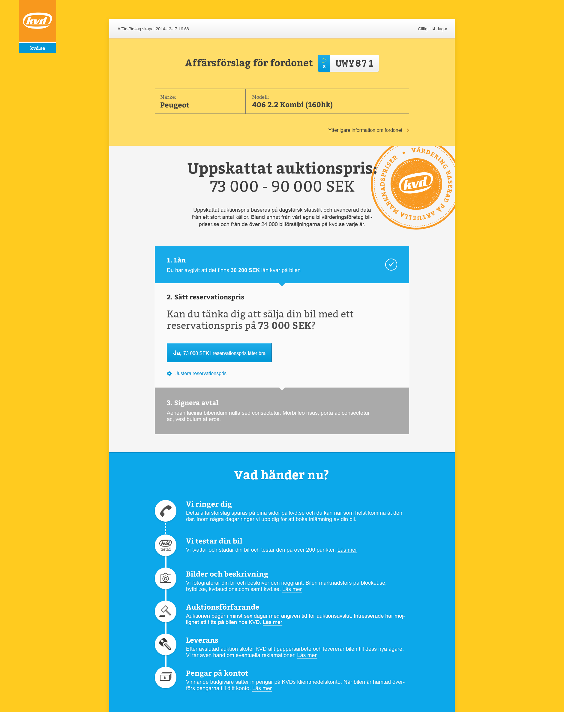

  
Första steget i registreringen

Designen har anpassats för att passa KVD:s grafiska profil utan att låsa sig till hur sidan i övriga utseende. En gul nyans användes redan för intresseanmälan på startsidan och behölls därför som primärfärg.

## Kunden kan göra (nästan) allt själv - med så få steg som möjligt
Målen för KVD var att hålla nere antalet steg som kunden behövder gå igenom. Utvecklingen skedde i flera sprintar och tjänsten fanns ute för kund så snart alla nödvändiga byggstenar fanns på plats. Nya funktioner introducerades efter hand.

  
Bildata hämtas och kunden anger eventuella tillval. Tillvalen varierar beroende på bilmodell.

## Affärsförslag
När intresseanmälan är klar kommer kunden till sitt affärsförslag. Här kan hen se föreslaget reservationspris samt modifiera det något (både upp och ner). När kunden är nöjd signeras avtalet med hjälp av BankID.

  
När intresseanmälan är klar landar användaren (som då loggat in/skapat ett konto) på sitt affärsförslag. Här kan hen själv se föreslaget reservationspris samt ändra detta.

## Säljflöde
Efter signeringen skapas ett säljflöde för bilen inne på kundens sida. I säljflödet kan kunden själv göra vissa inställningar som exempelvis ange bankkonto och boka en inlämningstid. Härifrån kan kunden även följa bildens väg genom KVD:s tester så snart den lämnats in.

  
Modal inne i säljflödet för att boka en inlämningstid.
