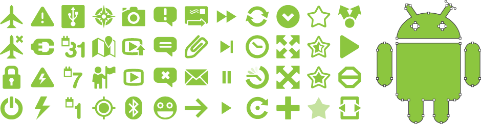

>>>>**Note!** These icons belong to the 2.x release of Android. [Google has updated all of these](http://google.github.io/material-design-icons/) in newer versions of Android. You may still use these but they are not in line with the default icons in Android.

Icons in Android 2.x came already styled and only in png format. This made it hard to use them in Googles then new toolbar desgins (first featured in the Twitter app). I needed some of the icons for a project and recrated them in Illustrator. I soon realised that this could help other Android designers and devlopers so I set out to vectorize all of them.

These icons are released as public domain, you may use them in any way you see fit. As public domain, I do not ask for attribution but it never hurts. If you decide to credit, plse link back to this page. Thank you!

A quick side note however, I did not make the origials, I vectorized them for easier use.

[Download](android-native-icons.zip){.button .i-download}